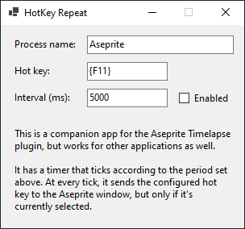

# HotKey Repeat

This is a very simple Windows desktop application to send a periodic hot key to a given application. It sends the hot key to the main window of that application, but only if the window is at the foreground (i.e., currently focused).

